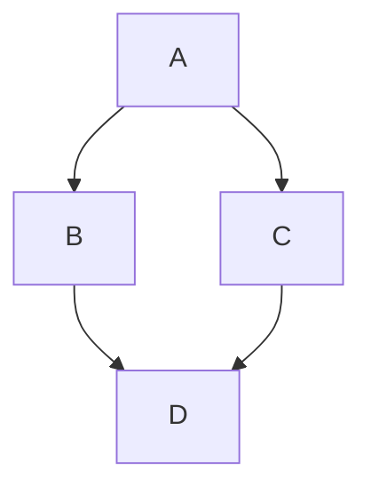

GitBlog supports GitHub flavoured markdown and syntax highlighting for code blocks.

Current Features:
- Headings
- Text Formatting
- Lists
- Tables
- Links
- Images
- Blockquotes
- Code Blocks w/Syntax Highlighting

Future Features:
- Mermaid Diagrams
- Inline HTML Support

## Headings  

# H1 - Largest Heading  
## H2 - Second Largest  
### H3 - Subheading  
#### H4 - Smaller Heading  
##### H5 - Tiny Heading  
###### H6 - Smallest Heading  

## Text Formatting  

- **Bold** → `**Bold**` → **Bold**  
- *Italic* → `*Italic*` → *Italic*  
- ~~Strikethrough~~ → `~~Strikethrough~~` → ~~Strikethrough~~

## Lists  

#### Bullet List  
- Item 1  
- Item 2  
- Item 3  

#### Numbered List  
1. First Item  
2. Second Item  
3. Third Item  

## Links & Images  

[GitHub](https://github.com)  


## Blockquotes

> "Markdown is a lightweight markup language for creating formatted text using a plain-text editor."
– John Gruber


## Tables
| Feature | Supported |
| ------------- | ------ |
| Bold/Italic   | ✅ Yes |
| Lists         | ✅ Yes |
| Code Blocks   | ✅ Yes |
| Tables        | ✅ Yes |
| Image         | ✅ Yes |
| Link          | ✅ Yes |

## Code Blocks

#### JavaScript Example
```javascript
function greet(name) {
  console.log(`Hello, my name is ${name}!`);
}

// Call the function
greet('Markdown');
```

#### C++ Example
```cpp
#include <iostream>
int main(){
  std::cout << "Hello from C++" << std::endl;
  return 0;
}
```

#### Python Example
```python
def calculate_sum(numbers):
    return sum(numbers)

# Example usage
result = calculate_sum([1, 2, 3, 4, 5])
print(f"The sum is: {result}")
```

## Mermaid Diagrams

